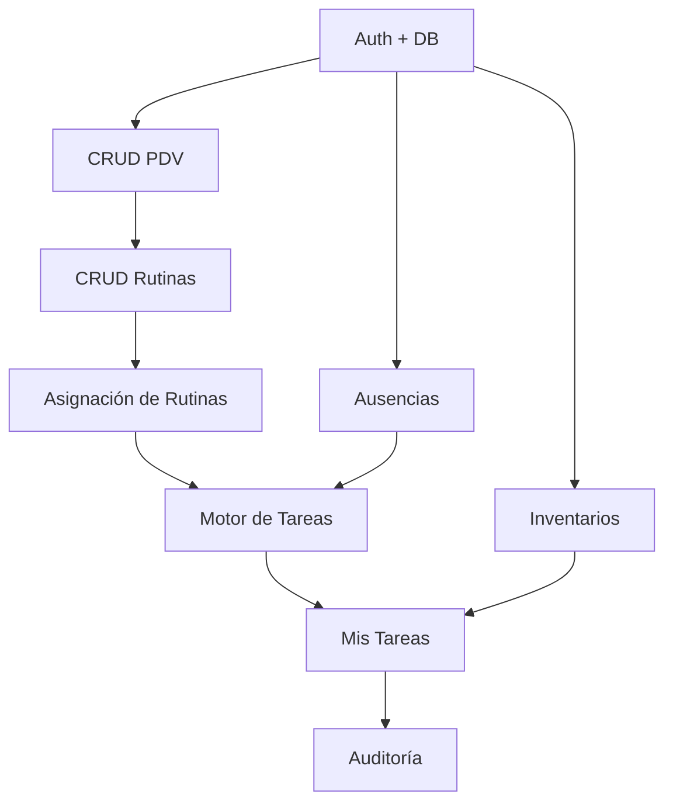

# PLAN.md — Plataforma Web de Rutinas Operativas y Control de PDV (V1)

**Proyecto:** Sistema de Gestión de Rutinas Operativas  
**Stack Tecnológico:** Vue 3 + Nuxt 3 + Supabase  
**Target:** 23 Puntos de Venta (PDV)  
**Fecha de Creación:** Enero 2026  
**Versión:** 1.0.0

---

## 📋 ÍNDICE DE DOCUMENTACIÓN

Este proyecto está dividido en múltiples archivos para facilitar la navegación:

1. **PLAN.md** (este archivo) - Resumen ejecutivo y arquitectura
2. **[MODULOS.md](./MODULOS.md)** - Especificación detallada de todos los módulos funcionales
3. **[DATABASE.md](./DATABASE.md)** - Modelo de datos completo y esquemas SQL
4. **[MOTOR_TAREAS.md](./MOTOR_TAREAS.md)** - Lógica del motor de generación automática
5. **[ROLES_PERMISOS.md](./ROLES_PERMISOS.md)** - Matriz completa de permisos y RLS
6. **[VALIDACIONES.md](./VALIDACIONES.md)** - Todas las reglas de validación
7. **[CRITERIOS_QA.md](./CRITERIOS_QA.md)** - Checklist de QA y aceptación

---

## 1. RESUMEN EJECUTIVO

### 1.1 Visión General

Sistema web responsive (desktop + móvil) para gestionar rutinas operativas estandarizadas en 23 puntos de venta (PDV), con enfoque en:

- **Estandarización:** Rutinas reutilizables y medibles
- **Trazabilidad:** Control total de quién, cuándo, dónde y cómo
- **Automatización:** Generación de tareas a las 5:00 a.m. diariamente (hora Colombia)
- **Prevención de fraude:** GPS obligatorio en operaciones sensibles
- **Control gerencial:** Dashboard en tiempo real + reportes exportables

### 1.2 Problema que Resuelve

| Antes | Después |
|-------|---------|
| Rutinas manuales sin seguimiento | Rutinas digitales con evidencia obligatoria |
| Omisiones frecuentes sin registro | 0 omisiones mediante alertas y bloqueos |
| Falta de evidencia en operaciones críticas | GPS + fotos + comentarios = trazabilidad total |
| Sin visibilidad gerencial del cumplimiento | Dashboard en vivo + reportes diarios/semanales/mensuales |
| Ausencias no gestionadas = tareas sin ejecutar | Sistema de ausencias con reasignación automática |

### 1.3 Usuarios Objetivo

| Rol | Cantidad Estimada | Uso Principal |
|-----|-------------------|---------------|
| **Director** | 1-2 | Configuración + monitoreo estratégico |
| **Líder** | 3-5 | Auditoría + supervisión + ejecución eventual |
| **Administrador** | 23 (1 por PDV) | Ejecución diaria de rutinas |
| **Auditor** | 1-2 | Revisión y aprobación/rechazo de tareas |

---

## 2. OBJETIVOS Y MÉTRICAS DE ÉXITO

### 2.1 Objetivos de Negocio (V1)

1. ✅ **Estandarización:** 100% de los 23 PDV operando con rutinas digitales en 30 días
2. ✅ **Cumplimiento:** >90% de tareas completadas a tiempo en mes 2
3. ✅ **Reducción de fraude:** GPS obligatorio en operaciones con manejo de efectivo/inventario
4. ✅ **Trazabilidad:** Audit trail completo en todas las operaciones
5. ✅ **Eficiencia operativa:** Reducir 60% tiempo de supervisión gerencial mediante dashboard

### 2.2 Métricas de Éxito Técnico

- ⚡ **Performance:** Carga inicial <2s, navegación <500ms
- 🟢 **Disponibilidad:** 99.5% uptime
- 📱 **Uso móvil:** 80% de ejecuciones desde dispositivo móvil
- 👥 **Adopción:** 100% usuarios activos en semana 2
- 🐛 **Errores:** <1% rate de fallos en generación de tareas

### 2.3 Criterios de Aceptación V1 (Must-Have)

**✅ El producto V1 está completo cuando cumple TODOS estos requisitos:**

- [ ] 1. Login funcional + recuperación de contraseña
- [ ] 2. 4 roles implementados con permisos correctos (Director, Líder, Admin, Auditor)
- [ ] 3. CRUD completo de PDV con georreferenciación
- [ ] 4. CRUD completo de rutinas (catálogo)
- [ ] 5. Módulo independiente de asignación de rutinas a PDV
- [ ] 6. Generación automática 5:00 a.m. funcionando 7 días seguidos sin fallos
- [ ] 7. Ejecución de tareas con validación GPS (cuando aplica)
- [ ] 8. Sistema de evidencias (fotos + archivos + comentarios)
- [ ] 9. Inventarios con categorías/productos + captura
- [ ] 10. Centro de mensajes 100% funcional + notificaciones push PWA
- [ ] 11. Centro de Mando con monitoreo + tarea flash
- [ ] 12. Auditoría con aprobado/rechazado + devolución para corrección
- [ ] 13. Reportes exportables (CSV/Excel)
- [ ] 14. Audit log del sistema
- [ ] 15. Gestión de ausencias con omitir/reasignar

---

## 3. ALCANCE DEL PROYECTO

### 3.1 ✅ Incluye en V1

#### Core Features
- Autenticación y autorización (4 roles)
- Gestión de PDV con georreferenciación
- Creación y gestión de rutinas (catálogo reutilizable)
- Asignación independiente de rutinas a PDV
- Generación automática diaria de tareas (5:00 a.m. Colombia)
- Ejecución con evidencias múltiples (fotos/archivos/comentarios/GPS)
- Inventarios: categorías → productos → toma de inventario
- Centro de mensajes + notificaciones in-app + push web
- Centro de Mando (monitoreo tiempo real + tarea flash)
- Auditoría bidireccional (aprobar/rechazar)
- Dashboard con KPIs
- Reportes exportables
- Gestión de ausencias con políticas
- Audit log completo del sistema

#### Funcionalidades Especiales
- 5 tipos de frecuencia de rutinas (diaria/semanal/quincenal/mensual/fechas específicas)
- Validación GPS con radio configurable
- Campos dinámicos en rutinas
- Comunicados broadcast
- Tareas flash (extraordinarias)
- Calendario de días especiales
- Galería de evidencias

### 3.2 ❌ No Incluye en V1 (Deuda Técnica para V2)

- Integraciones externas (WhatsApp, ERP, POS)
- Modo offline completo (preparado pero no implementado)
- Analítica avanzada tipo Machine Learning
- App nativa iOS/Android (solo PWA)
- Reconocimiento facial/biométrico
- Integraciones con cámaras de seguridad
- Optimizaciones de caché avanzadas
- Sincronización offline robusta
- Exportación PDF con gráficos
- Notificaciones SMS/WhatsApp
- Webhooks para integraciones

---

## 4. RESTRICCIONES TÉCNICAS

### 4.1 🚫 Prohibición Explícita

**NO SE DEBE USAR REACT EN NINGUNA PARTE DEL PROYECTO**

Esta es una restricción absoluta del negocio. Cualquier librería, componente o dependencia que incluya React debe ser rechazada.

### 4.2 Stack Tecnológico Aprobado

#### Frontend
```yaml
Framework: Vue 3 + Nuxt 3 (obligatorio)
UI Library: Tailwind CSS + componentes propios
State Management: Pinia
Forms: VeeValidate + Yup
HTTP Client: ofetch (built-in Nuxt)
Geolocation: Browser Geolocation API
File Upload: Uppy (sin React)
Date/Time: date-fns o Day.js
Charts: Chart.js o Apache ECharts (sin React)
```

#### Backend
```yaml
BaaS: Supabase
  - Auth: Supabase Auth (email/password)
  - Database: PostgreSQL (Supabase)
  - Storage: Supabase Storage
  - Realtime: Supabase Realtime (subscriptions)
  - Edge Functions: Deno (lógica serverless)
```

#### Infraestructura
```yaml
Hosting: Vercel o Netlify
Database: Supabase (managed PostgreSQL)
CDN: Cloudflare (assets)
Monitoring: Sentry (errores) + Plausible (analytics)
```

#### Jobs y Automatización
```yaml
Cron Jobs: Supabase Edge Functions + pg_cron
  - Tarea diaria 5:00 a.m.: generación de tareas
  - Limpieza mensual: archivos temporales
```

#### Notificaciones
```yaml
In-app: Supabase Realtime
Push Web: Service Worker (PWA) + web-push
NO incluye: SMS, WhatsApp, email masivo
```

### 4.3 Compatibilidad

| Navegador | Versión Mínima |
|-----------|----------------|
| Chrome | 90+ |
| Firefox | 88+ |
| Safari | 14+ |
| Edge | 90+ |
| Mobile Safari | iOS 14+ |
| Chrome Android | 90+ |

**Dispositivos:**
- **Desktop:** 1366x768 mínimo, 4GB RAM, 5 Mbps
- **Móvil:** Android 10+ / iOS 14+, 2GB RAM, GPS + cámara, 3G+ (recomendado 4G)

---

## 5. ARQUITECTURA DEL SISTEMA

### 5.1 Diagrama de Arquitectura

```
┌─────────────────────────────────────────────────────────────┐
│                         FRONTEND                             │
│                    Vue 3 + Nuxt 3 + PWA                      │
├─────────────────────────────────────────────────────────────┤
│  ┌─────────────┐  ┌──────────────┐  ┌─────────────────┐   │
│  │   Layouts   │  │  Components  │  │  Composables    │   │
│  │  (Desktop/  │  │   (UI Kit)   │  │  (Business      │   │
│  │   Mobile)   │  │              │  │   Logic)        │   │
│  └─────────────┘  └──────────────┘  └─────────────────┘   │
│                                                              │
│  ┌─────────────┐  ┌──────────────┐  ┌─────────────────┐   │
│  │   Pages     │  │    Pinia     │  │  Middleware     │   │
│  │  (Routes)   │  │   (State)    │  │  (Auth/Guard)   │   │
│  └─────────────┘  └──────────────┘  └─────────────────┘   │
└─────────────────────────────────────────────────────────────┘
                            ↓ ↑
                     Supabase Client
                            ↓ ↑
┌─────────────────────────────────────────────────────────────┐
│                      SUPABASE (BaaS)                         │
├─────────────────────────────────────────────────────────────┤
│  ┌─────────────┐  ┌──────────────┐  ┌─────────────────┐   │
│  │   Auth      │  │  PostgreSQL  │  │   Storage       │   │
│  │  (Users +   │  │  (Database)  │  │  (Files/       │   │
│  │   Roles)    │  │              │  │   Images)       │   │
│  └─────────────┘  └──────────────┘  └─────────────────┘   │
│                                                              │
│  ┌─────────────┐  ┌──────────────┐  ┌─────────────────┐   │
│  │  Realtime   │  │    Edge      │  │    pg_cron      │   │
│  │  (Websocket)│  │  Functions   │  │  (Scheduled     │   │
│  │             │  │  (Deno)      │  │   Jobs)         │   │
│  └─────────────┘  └──────────────┘  └─────────────────┘   │
└─────────────────────────────────────────────────────────────┘
                            ↓
┌─────────────────────────────────────────────────────────────┐
│                   EXTERNAL SERVICES                          │
├─────────────────────────────────────────────────────────────┤
│  ┌─────────────┐  ┌──────────────┐  ┌─────────────────┐   │
│  │   Sentry    │  │  Plausible   │  │   Cloudflare    │   │
│  │  (Errors)   │  │ (Analytics)  │  │     (CDN)       │   │
│  └─────────────┘  └──────────────┘  └─────────────────┘   │
└─────────────────────────────────────────────────────────────┘
```

### 5.2 Flujo de Datos

```
1. Usuario ingresa → Nuxt SSR renderiza HTML inicial
2. Vue 3 hidrata la aplicación → SPA
3. Middleware verifica autenticación (Supabase Auth)
4. Composables ejecutan queries (Supabase Client)
5. PostgreSQL + RLS retorna datos filtrados por rol
6. Pinia actualiza estado global
7. Componentes Vue re-renderizan
8. Service Worker maneja push notifications
```

### 5.3 Patrones de Diseño

**Frontend:**
- **Composables** para lógica reutilizable (hooks)
- **Layouts** para estructura común (desktop/mobile)
- **Components** atómicos y moleculares (UI Kit)
- **Pages** como orquestadores
- **Stores (Pinia)** para estado global

**Backend:**
- **RLS (Row Level Security)** para autorización granular
- **Database Functions** para lógica compleja
- **Triggers** para audit log y cascadas
- **Views** para reportes complejos
- **Edge Functions** para operaciones serverless

### 5.4 Multi-tenancy

```sql
-- Todas las tablas tienen columna tenant_id
CREATE TABLE pdv (
  id UUID PRIMARY KEY DEFAULT gen_random_uuid(),
  tenant_id UUID NOT NULL REFERENCES tenants(id),
  nombre VARCHAR(100) NOT NULL,
  -- ... otros campos
  UNIQUE(tenant_id, codigo_interno)
);

-- RLS Policy
CREATE POLICY "Users see own tenant data"
  ON pdv FOR SELECT
  USING (tenant_id = auth.jwt() ->> 'tenant_id');
```

**Reglas:**
- Todo dato pertenece a un tenant
- RLS filtra automáticamente por tenant
- No se puede acceder a datos de otro tenant
- Queries siempre incluyen `tenant_id` implícitamente

---

## 6. ESTRUCTURA DE NAVEGACIÓN

### 6.1 Menú Principal (Sidebar)

```
┌─────────────────────────────────────┐
│  Logo + Nombre de Usuario           │
│  Rol: Director / PDV: Central       │
├─────────────────────────────────────┤
│  📊 OPERACIÓN                        │
│    ├─ Dashboard                     │
│    ├─ Mis Tareas                    │
│    ├─ Mensajes (badge: 3)           │
│    └─ Centro de Mando (🔴 en vivo)  │
├─────────────────────────────────────┤
│  ✅ CONTROL                          │
│    ├─ Auditoría (badge: 12)         │
│    ├─ Galería                        │
│    └─ Reportes                       │
├─────────────────────────────────────┤
│  ⚙️  CONFIGURACIÓN                   │
│    ├─ Puntos de Venta                │
│    ├─ Rutinas (Catálogo)            │
│    ├─ Asignación de Rutinas         │
│    ├─ Inventarios ▼                  │
│    │   ├─ Categorías y Productos    │
│    │   └─ Snapshot / Stock          │
│    ├─ Calendario                     │
│    ├─ Gestión Personal               │
│    ├─ Audit Sistema                  │
│    └─ Ajustes Generales              │
└─────────────────────────────────────┘
```

### 6.2 Visibilidad por Rol

Ver archivo **[ROLES_PERMISOS.md](./ROLES_PERMISOS.md)** para matriz completa.

---

## 7. MÓDULOS PRINCIPALES

> **NOTA:** La especificación detallada de cada módulo está en **[MODULOS.md](./MODULOS.md)**

### 7.1 Resumen de Módulos

1. **Autenticación** - Login, recuperación, cambio de contraseña
2. **Puntos de Venta** - CRUD PDV con georreferenciación
3. **Inventarios** - Categorías, productos, snapshot
4. **Rutinas (Catálogo)** - Creación de plantillas reutilizables
5. **Asignación de Rutinas** - Módulo independiente para asignar a PDV
6. **Gestión Personal** - Ausencias con omitir/reasignar
7. **Mis Tareas** - Ejecución operativa con evidencias
8. **Centro de Mensajes** - Comunicación interna + notificaciones
9. **Centro de Mando** - Monitoreo tiempo real + tarea flash
10. **Auditoría** - Aprobación/rechazo de tareas
11. **Galería** - Evidencias multimedia
12. **Reportes** - Exportables CSV/Excel
13. **Dashboard** - KPIs y métricas
14. **Audit Sistema** - Log de cambios

---

## 8. MOTOR DE TAREAS (Core Engine)

> **NOTA:** La especificación completa está en **[MOTOR_TAREAS.md](./MOTOR_TAREAS.md)**

### 8.1 Generación Automática Diaria

```javascript
// Se ejecuta todos los días a las 5:00 a.m. (hora Colombia)
async function generarTareasDiarias(fecha) {
  const pdvsActivos = await getPDVsActivos();
  
  for (const pdv of pdvsActivos) {
    const responsable = await getResponsableVigente(pdv.id, fecha);
    
    if (!responsable) {
      log.warn(`PDV ${pdv.nombre} sin responsable`);
      continue;
    }
    
    // Verificar ausencia
    const ausencia = await getAusenciaVigente(responsable.id, fecha);
    if (ausencia && ausencia.politica === 'omitir') {
      continue; // No generar tareas
    }
    if (ausencia && ausencia.politica === 'reasignar') {
      responsable = await getUsuario(ausencia.receptor_id);
    }
    
    // Generar tareas
    const rutinas = await getRutinasAsignadas(pdv.id, fecha);
    for (const rutina of rutinas) {
      if (debeGenerarse(rutina, fecha)) {
        await crearTarea(rutina, pdv, responsable, fecha);
      }
    }
  }
}
```

### 8.2 Tipos de Frecuencia

| Frecuencia | Generación | Vencimiento |
|------------|------------|-------------|
| **Diaria** | Días seleccionados | Hora límite del día |
| **Semanal** | Días de la semana | Hora límite del día |
| **Quincenal** | Día 1 y 16 del mes | Día 15 y 30 |
| **Mensual** | Día 1 del mes | Día X del mes |
| **Fechas específicas** | Fechas exactas | Hora límite del día |

---

## 9. MODELO DE DATOS

> **NOTA:** El esquema SQL completo está en **[DATABASE.md](./DATABASE.md)**

### 9.1 Tablas Principales

```
tenants
profiles (auth linkage)
pdv
pdv_assignments (histórico de responsables)
routine_templates
routine_versions
routine_fields
routine_assignments
inventory_categories
inventory_products
absence_types
user_absences
task_instances
task_submissions
task_field_values
evidence_files
inventory_submission_rows
messages
message_recipients
audit_reviews
system_audit_log
```

---

## 10. REGLAS DE VALIDACIÓN

> **NOTA:** Todas las validaciones detalladas están en **[VALIDACIONES.md](./VALIDACIONES.md)**

### 10.1 Campos Obligatorios (Anti-Fallo)

**PDV:**
- nombre, ciudad, codigo_interno, estado, radio_gps
- lat/long condicional (si hay rutinas GPS)

**Rutina:**
- nombre, descripción, prioridad, estado, frecuencia, hora_inicio, hora_limite
- roles_ejecutores >= 1

**Asignación:**
- rutina_id, pdv_id(s), estado
- Si GPS requerido → PDV debe tener lat/long

**Ausencia:**
- user_id, tipo, desde, hasta, política
- Si reasignar → receptor_id obligatorio

---

## 11. KPIs Y MÉTRICAS

### 11.1 Dashboard Principal

**Cumplimiento Global:**
```
Cumplimiento a tiempo = (completadas_on_time / total) * 100
Cumplimiento vencido = (completadas_late / total) * 100
Incumplimiento = (missed / total) * 100
```

**PDV Críticos:**
- PDV con >= 3 incumplidas de prioridad alta
- GPS fuera de rango en rutina crítica
- >= 2 rechazos de auditoría

**Auditoría:**
- % aprobadas
- % rechazadas
- Motivos más frecuentes de rechazo

---

## 12. SEGURIDAD Y COMPLIANCE

### 12.1 Row Level Security (RLS)

Todas las tablas implementan RLS basado en:
- `tenant_id` (multi-tenancy)
- `role` del usuario (permisos)
- Relaciones específicas (ej: responsable de PDV)

Ver **[ROLES_PERMISOS.md](./ROLES_PERMISOS.md)** para policies completas.

### 12.2 Audit Trail

```sql
CREATE TABLE system_audit_log (
  id UUID PRIMARY KEY,
  tenant_id UUID NOT NULL,
  user_id UUID NOT NULL,
  action VARCHAR(50) NOT NULL, -- 'create', 'update', 'delete'
  table_name VARCHAR(100) NOT NULL,
  record_id UUID,
  old_values JSONB,
  new_values JSONB,
  ip_address VARCHAR(45),
  user_agent TEXT,
  created_at TIMESTAMP DEFAULT NOW()
);
```

---

## 13. PLAN DE IMPLEMENTACIÓN

### 13.1 Fases de Desarrollo

**Fase 1: Fundamentos (Semana 1-2)**
- [ ] Setup proyecto Nuxt 3 + Supabase
- [ ] Configuración multi-tenancy
- [ ] Sistema de autenticación
- [ ] Estructura de base de datos
- [ ] RLS policies básicas
- [ ] Layout y navegación

**Fase 2: Configuración (Semana 3-4)**
- [ ] CRUD PDV
- [ ] CRUD Rutinas (catálogo)
- [ ] Módulo Asignación de Rutinas
- [ ] CRUD Inventarios (categorías/productos)
- [ ] Gestión de ausencias
- [ ] Calendario

**Fase 3: Operaciones (Semana 5-6)**
- [ ] Motor de generación de tareas (5:00 a.m.)
- [ ] Módulo "Mis Tareas" (ejecución)
- [ ] Sistema de evidencias (fotos/archivos/GPS)
- [ ] Captura de inventarios
- [ ] Validaciones en tiempo real

**Fase 4: Control (Semana 7-8)**
- [ ] Centro de mensajes + notificaciones
- [ ] Centro de Mando
- [ ] Módulo de auditoría
- [ ] Galería de evidencias
- [ ] Dashboard con KPIs

**Fase 5: Reportes y Pulido (Semana 9-10)**
- [ ] Reportes exportables
- [ ] Audit log del sistema
- [ ] PWA (Service Worker + push)
- [ ] Optimizaciones de performance
- [ ] Testing completo

**Fase 6: Deploy y Capacitación (Semana 11-12)**
- [ ] Deploy a producción
- [ ] Migración de datos (si aplica)
- [ ] Capacitación usuarios
- [ ] Monitoreo y ajustes

### 13.2 Dependencias Críticas



---

## 14. CRITERIOS DE ACEPTACIÓN

Ver **[CRITERIOS_QA.md](./CRITERIOS_QA.md)** para checklist completo.

### 14.1 Checklist Mínimo

**Funcional:**
- [ ] Todos los roles pueden hacer login
- [ ] Generación automática funciona 7 días consecutivos sin fallos
- [ ] GPS valida correctamente dentro/fuera de rango
- [ ] Fotos se suben y visualizan correctamente
- [ ] Inventarios calculan diferencias correctamente
- [ ] Ausencias omiten/reasignan tareas correctamente
- [ ] Auditoría aprueba/rechaza con devolución
- [ ] Mensajes llegan + notificaciones push funcionan
- [ ] Reportes exportan correctamente
- [ ] Audit log registra todas las acciones

**Performance:**
- [ ] Carga inicial < 2s
- [ ] Navegación < 500ms
- [ ] Subida de fotos < 5s por foto

**Seguridad:**
- [ ] RLS impide ver datos de otros tenants
- [ ] Usuarios no pueden elevar privilegios
- [ ] Contraseñas encriptadas
- [ ] Sesiones expiran correctamente

---

## 15. GLOSARIO

| Término | Definición |
|---------|------------|
| **PDV** | Punto De Venta |
| **Rutina** | Plantilla de tarea estandarizada reutilizable |
| **Asignación** | Vinculación de una rutina a uno o más PDV |
| **Tarea** | Instancia de rutina generada para un día/PDV/responsable específico |
| **Submission** | Ejecución/completación de una tarea con evidencias |
| **RLS** | Row Level Security (seguridad a nivel de fila en PostgreSQL) |
| **Tenant** | Organización/negocio (multi-tenancy) |
| **Audit Trail** | Registro de cambios del sistema |

---

## 16. CONTACTOS Y REFERENCIAS

**Equipo:**
- Product Owner: [Nombre]
- Tech Lead: [Nombre]
- Frontend Dev: [Nombre]
- Backend Dev: [Nombre]

**Recursos:**
- Supabase Docs: https://supabase.com/docs
- Vue 3 Docs: https://vuejs.org/guide/
- Nuxt 3 Docs: https://nuxt.com/docs

---

## 17. CHANGELOG

| Versión | Fecha | Cambios |
|---------|-------|---------|
| 1.0.0 | 2026-01-20 | Documento inicial |

---

**FIN DEL PLAN PRINCIPAL**

> Para detalles completos de cada módulo, consulta los archivos complementarios mencionados al inicio de este documento.
